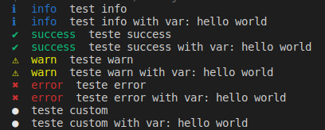

# Pretty Log
Get beautiful consoles easily


### Prerequisites

* [NPM](https://www.npmjs.com/)
* [YARN](https://yarnpkg.com/)

### Installing
Using NPM
```
npm i @emersonbraun/pretty-log
```
OR Yarn
```
yarn add @emersonbraun/pretty-log
```

### Usage

import package
```
import PrettyLog from '@emersonbraun/pretty-log'
```
Type Info
```
PrettyLog.info('test info')
```
Type success
```
PrettyLog.success('teste success')
```
Type warn
```
PrettyLog.warn('teste warn')
```
Type error
```
PrettyLog.error('teste error')
```
Type custom
```
PrettyLog.custom('teste custom', null, {
  iconColor: 'white',
  icon: 'bullet',
})
```

## Versioning

We use [SemVer](http://semver.org/) for versioning. For the versions available, see the [tags on this repository](https://github.com///tags). 

## Author

* **emersonbraun** - *Initial work* - [EmersonBraun](https://github.com/EmersonBraun)

See also the list of [contributors](https://github.com/EmersonBraun/pretty-log/contributors) who participated in this project.

## License

This project is licensed under the MIT License - see the [LICENSE.md](LICENSE.md) file for details